<div align="center">

# hyprtk

### Hyprland Tinkerer

Arch is my favourite desktop OS. I build dotfiles for Arch-based distros and tweak Hyprland until it sings.

<a href="https://github.com/hyprtk/dotfiles"></a>
<a href="https://github.com/hyprtk/hyprtk-bar"></a>
<a href="https://github.com/hyprtk/hyprtk-web"></a>


</div>

---

<div align="center">

## Two projects. One desktop.

</div>

<table>
<tr>
<td width="50%" valign="top">

### 🗂️ hyprtk dotfiles

**One installer. Eleven Arch-based distros.**

A unified, `gum`-powered installer that deploys a complete, pywal16-themed Hyprland desktop — 37 dotfiles, 18 package groups, 46 scripts and a full **XFCE fallback** for safety. Every colour on screen is generated from your wallpaper.

[**Explore the installer →**](https://github.com/hyprtk/dotfiles)

</td>
<td width="50%" valign="top">

### 🪟 hyprtk-bar

**The bar that is the whole desktop.**

A standalone GTK3 taskbar + desktop suite: task list, start menu, arc launcher, notification center, system tray, quick settings, system monitor and theme manager — all themed live from your pywal16 palette.

[**Explore hyprtk-bar →**](https://github.com/hyprtk/hyprtk-bar)

</td>
</tr>
</table>

---

<div align="center">

## 01 · hyprtk dotfiles

*The installer behind the desktop.*

<!-- prettier-ignore -->
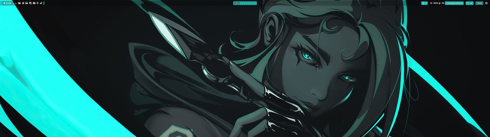

</div>

<div align="center">

### One installer, every Arch-based distro

A single `1-install.sh` detects your distribution and lays down a matching, hand-tuned Hyprland desktop. The same command deploys to all eleven supported systems — and keeps them in sync.

</div>

<div align="center">
<table>
<tr>
<td align="center" width="33%"><b>🎨 pywal16 pipeline</b><br /><sub>One wallpaper drives every colour on the desktop</sub></td>
<td align="center" width="33%"><b>🧩 gum TUI installer</b><br /><sub>Auto-detects distro, 18 package groups, clean prompts</sub></td>
<td align="center" width="33%"><b>🖥️ XFCE fallback</b><br /><sub>A full desktop safety-net alongside Hyprland</sub></td>
</tr>
<tr>
<td align="center" width="33%"><b>🪟 hyprtk-bar bundled</b><br /><sub>The desktop suite installs and autostarts with it</sub></td>
<td align="center" width="33%"><b>🧠 Modular Lua config</b><br /><sub>18 Lua files for a clean, hackable Hyprland setup</sub></td>
<td align="center" width="33%"><b>⚡ NVIDIA & AMD ready</b><br /><sub>Dedicated configs, DRM and AMDGPU support</sub></td>
</tr>
<tr>
<td align="center" width="33%"><b>🛠️ 46 utility scripts</b><br /><sub>Volume, brightness, recording, QEMU and more</sub></td>
<td align="center" width="33%"><b>🖼️ Wallpaper tools</b><br /><sub>Random picker, rofi selector, film roll</sub></td>
<td align="center" width="33%"><b>🔒 Session & lock</b><br /><sub>swaylock blur, logout menu, SDDM/GRUB theming</sub></td>
</tr>
</table>
</div>

<br />

<div align="center"><h4>Showcase · the same desktop on every distro</h4></div>

<table>
<tr>
<td width="33%" align="center"><br /><b>Arch Linux</b></td>
<td width="33%" align="center">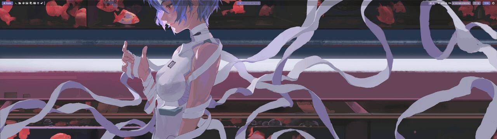<br /><b>EndeavourOS</b></td>
<td width="33%" align="center">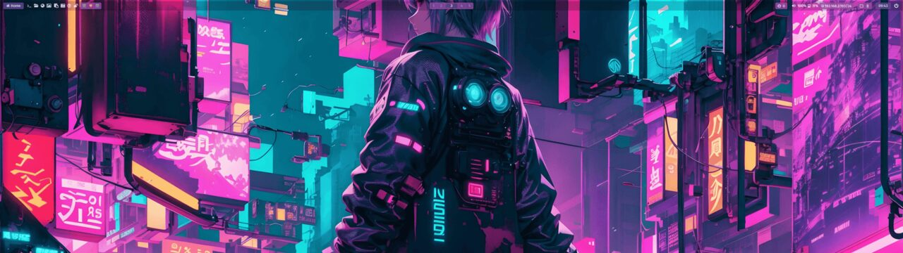<br /><b>Garuda</b></td>
</tr>
<tr>
<td width="33%" align="center">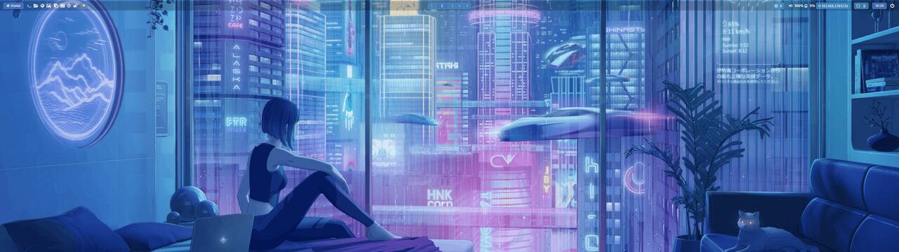<br /><b>CachyOS</b></td>
<td width="33%" align="center">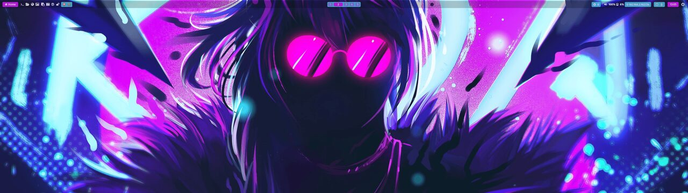<br /><b>Archcraft</b></td>
<td width="33%" align="center">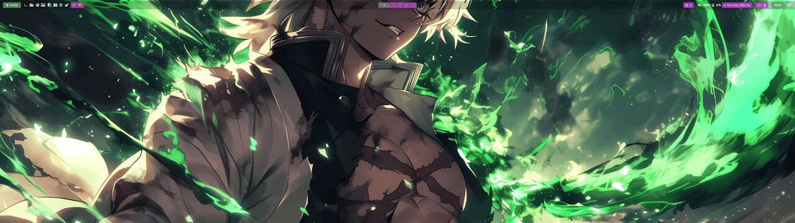<br /><b>ArchBANG</b></td>
</tr>
<tr>
<td width="33%" align="center"><br /><b>Archman</b></td>
<td width="33%" align="center"><br /><b>BlueStar</b></td>
<td width="33%" align="center">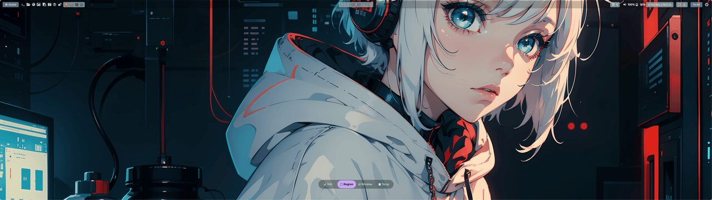<br /><b>Kiro</b> <sub>(ArcoLinux)</sub></td>
</tr>
<tr>
<td width="33%" align="center">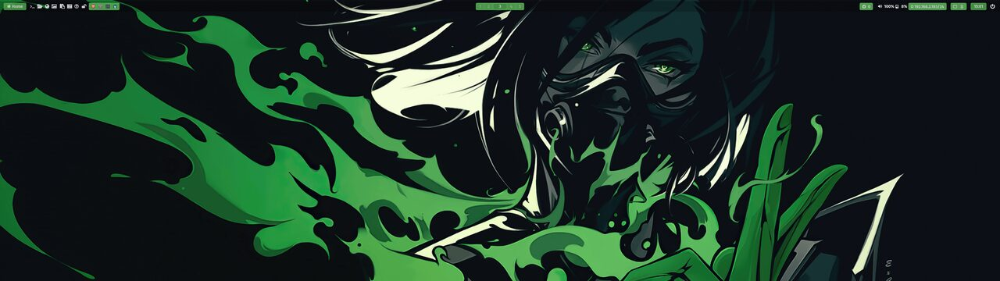<br /><b>Manjaro</b></td>
<td width="33%" align="center">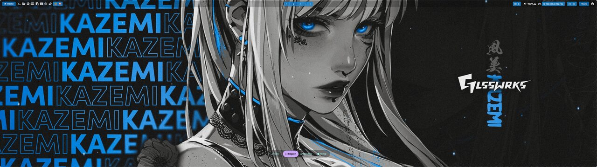<br /><b>RebornOS</b></td>
<td width="33%" align="center">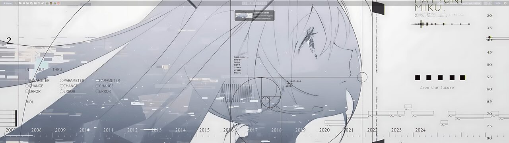<br /><b>my-dots</b> <sub>(personal)</sub></td>
</tr>
</table>

<br />

<div align="center">

### Install

```bash
git clone https://github.com/hyprtk/dotfiles
cd dotfiles
./1-install.sh
```

<a href="https://github.com/hyprtk/dotfiles"></a>

</div>

---

<div align="center">

## 02 · hyprtk-bar

*The taskbar, menu, notifier and control center — in one GTK3 suite.*

<!-- prettier-ignore -->


<sub>A fully modular taskbar: start button, quick links, task list, active window · centred workspaces · updates, system monitor, keyboard state, clock, notifications, tray and quick settings.</sub>

</div>

<div align="center">

### A complete desktop suite

hyprtk-bar replaced a stack of separate tools — a bar, a launcher, a notification daemon and a theme manager — with one standalone app. It talks to Hyprland over IPC, renders with GTK3 layer-shell, and re-themes itself the instant your wallpaper changes.

</div>

<div align="center">
<table>
<tr>
<td align="center" width="33%"><b>🧩 Modular bar</b><br /><sub>Arrange, show/hide and reorder modules from settings</sub></td>
<td align="center" width="33%"><b>📋 Task list</b><br /><sub>Pinned + running apps, hover previews, focus / minimize / close</sub></td>
<td align="center" width="33%"><b>🔔 Notification center</b><br /><sub>Built-in <code>org.freedesktop.Notifications</code> daemon with toasts</sub></td>
</tr>
<tr>
<td align="center" width="33%"><b>🚀 Start menu</b><br /><sub>Four layouts: Whisker, Windows 7, Windows 11, Plasma</sub></td>
<td align="center" width="33%"><b>🌀 Arc menu</b><br /><sub>Radial Material-style app launcher overlay</sub></td>
<td align="center" width="33%"><b>🎛️ System tray</b><br /><sub>StatusNotifier + native DBusMenu menus</sub></td>
</tr>
<tr>
<td align="center" width="33%"><b>📊 System monitor</b><br /><sub>CPU, memory, disks, network, GPU and process manager</sub></td>
<td align="center" width="33%"><b>🎨 Theme manager</b><br /><sub>Wallpaper, pywal, rofi, bar themes, icons, SDDM & GRUB</sub></td>
<td align="center" width="33%"><b>⚙️ Quick settings</b><br /><sub>Wi-Fi, Bluetooth, volume + mic, brightness</sub></td>
</tr>
</table>
</div>

<br />

<div align="center"><h4>Showcase · start menu</h4></div>

<table>
<tr>
<td width="25%" align="center">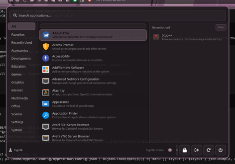<br /><b>Whisker</b></td>
<td width="25%" align="center"><br /><b>Windows 7</b></td>
<td width="25%" align="center">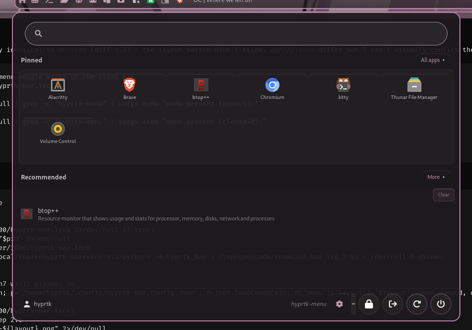<br /><b>Windows 11</b></td>
<td width="25%" align="center">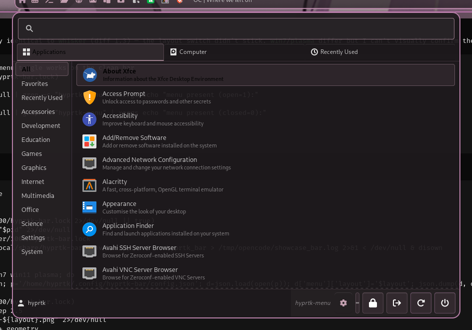<br /><b>Plasma</b></td>
</tr>
</table>

<div align="center"><h4>Showcase · app launcher, settings &amp; widgets</h4></div>

<table>
<tr>
<td width="25%" align="center"><br /><b>Arc menu</b></td>
<td width="25%" align="center"><br /><b>Quick settings</b></td>
<td width="25%" align="center">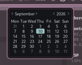<br /><b>Calendar</b></td>
<td width="25%" align="center"><br /><b>Settings</b></td>
</tr>
</table>

<div align="center"><h4>Showcase · monitors &amp; theming</h4></div>

<table>
<tr>
<td width="50%" align="center">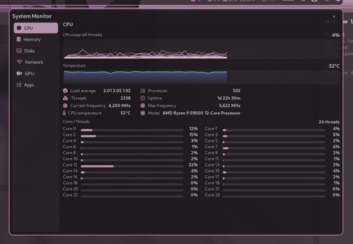<br /><b>System monitor</b></td>
<td width="50%" align="center">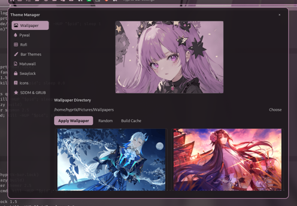<br /><b>Theme manager</b></td>
</tr>
</table>

<div align="center"><h4>Showcase · notifications</h4></div>

<table>
<tr>
<td width="50%" align="center">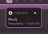<br /><b>Toast</b></td>
<td width="50%" align="center">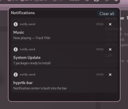<br /><b>Notification center</b></td>
</tr>
</table>

<br />

<div align="center">

### Install

```bash
git clone https://github.com/hyprtk/hyprtk-bar
cd hyprtk-bar
./install.sh
```

The installer detects your package manager, installs the GTK3 / gtk-layer-shell
typelibs and feature dependencies, bundles eight bar themes and four wallpapers,
and registers the bar with Hyprland's autostart. Then run `./install.sh --dry-run`
first if you want to check requirements without changing anything.

<a href="https://github.com/hyprtk/hyprtk-bar"></a>

</div>

---

<div align="center">

## Supported distributions

**11 distros · custom-tuned per distro**

`Arch Linux` · `ArchBANG` · `Archcraft` · `Archman` · `BlueStar` · `CachyOS` · `EndeavourOS` · `Garuda` · `Kiro` · `Manjaro` · `RebornOS`

<sub>plus <a href="https://github.com/hyprtk/my-dots">my-dots</a>, a personal build</sub>

<br />

## Stack

<div>

<a href="https://hypr.land"></a>


</div>

</div>

---

<div align="center">

## Hyprland update log

| Version | Notes |
|:-------:|:------|
| `0.55.4` | Conversion from `.conf` to `.lua` format for the Hyprland config |
| `0.55` | Removal of the Dwindle layout — dotfiles updated accordingly |

</div>

---

<div align="center">

## GitHub stats

<p>
  
  
</p>


<p>
  
</p>

<picture>
  <source media="(prefers-color-scheme: dark)" srcset="https://raw.githubusercontent.com/abozanona/abozanona/output/pacman-contribution-graph-dark.svg">
  <source media="(prefers-color-scheme: light)" srcset="https://raw.githubusercontent.com/abozanona/abozanona/output/pacman-contribution-graph.svg">
  
</picture>

</div>

---

<div align="center">

<a href="https://github.com/hyprtk/dotfiles">dotfiles</a> ·
<a href="https://github.com/hyprtk/hyprtk-bar">hyprtk-bar</a> ·
<a href="https://github.com/hyprtk">hyprtk</a>

</div>
